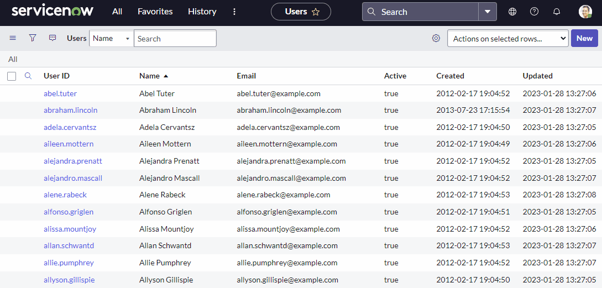

# Authentication
Currently only basic auth is supported. OAuth support will be coming in the next version.
```powershell
Set-SNOWAuth -Instance "InstanceName" -Credential (Get-Credential)
```

# Table API
The Table API is one of the most commonly used, it supports [CRUD](https://en.wikipedia.org/wiki/Create,_read,_update_and_delete) operations on any table within the platform.  

There are 4 core functions to use the Table API:
- [Get-SNOWObject](#get-snowobject)
- [Set-SNOWObject](#set-snowobject)
- [New-SNOWObject](#new-snowobject)
- [Remove-SNOWObject](#remove-snowobject)
  
All table functions are based on the above core functions and inherit the same basic parameters.  
They operate mostly the same way.  
They also have parameters mapped for properties in each respective table (for example, Get-SNOWUser has a -user_name parameter, amongst others).

Below I will cover each of these functions with examples, followed by a table specific function along side.

## Get-SNOWObject

### Direct record lookup
Every record in ServiceNow has a unique identifier called a sys_id, this can be used to lookup objects directly:

```powershell
Get-SNOWObject -Table "sys_user" -Sys_ID "7dad954b47a12110d3e5fa8bd36d43a8"
OR
Get-SNOWUser -Sys_ID "7dad954b47a12110d3e5fa8bd36d43a8"
```

### Queries
I would recommend familiarizing with the [query operators](https://docs.servicenow.com/csh?topicname=r_OpAvailableFiltersQueries.html&version=latest) in servicenow before proceeding.

```powershell
Get-SNOWObject -Table "sys_user" -Query "active=true^ORDERBYsys_updated_on"
OR
Get-SNOWUser -Query "active=true^ORDERBYDESCsys_updated_on"
```

Alternatively queries can be copy pasted straight from the GUI into any `Get-SNOW*` command:



### Display values & reference links
Returned objects often contain referenced fields which by default will have two values, a link to the object and the sys_id value.

Rather than looking up that object to find out it's display name `-DisplayValue true` can be provided.  
Using this in tandem with `-ExcludeReferenceLinks` will also flatten the object and only return the display value.

Example:

```powershell
Get-SNOWUser -Limit 1 -DisplayValue true -ExcludeReferenceLinks
```
Possible values for `-DisplayValue` are 'true', 'false' (default) & 'all'

### Fields & Dot walking
The `-Fields` parameter can be used to lessen the burden on each call made.  
If you are retrieving an entire table but only need to know a few values you could do the following to make faster calls:

```powershell
Get-SNOWUser -Query "active=true" -Fields @('sys_id','user_name','email')
```

Dot walking can also ease the burden and save from making additional calls:

```powershell

$GetSNOWUser = @{
    Query = "user_name=billie.cowley"
    Fields = @(
        'sys_id'       
        'email'
        'manager'
        'manager.email'    
    )
    ExcludeReferenceLinks = $true
}
Get-SNOWUser @GetSNOWUser

# Returns:
sys_id        : 02826bf03710200044e0bfc8bcbe5d88
manager.email : krystle.stika@example.com
manager       : 02826bf03710200044e0bfc8bcbe5d7f
email         : billie.cowley@example.com
```

### Pagination
All get commands will automatically paginate calls so that requests do not time out.  
By default 1000 records are returned in each request, until there are no more records left to fetch.  
Each `Get-SNOW*` command has both `-limit` and `-offset` which will allow pagination to be controlled manually if this is needed.

## Set-SNOWObject
`Set-SNOW*` Commands require a `-sys_id` to indicate which record to modify. This value can be piped by property name.  
If using `Set-SNOWObject` a `-table` must also be provided if the object is not being piped.

```powershell
$user = Get-SNOWObject -table "sys_user" -query "user_name=bruce.wayne"
$user | Set-SNOWObject -Properties @{middle_name="Thomas"}
OR
$user = Get-SNOWUser -user_name "bruce.wayne"
$user | Set-SNOWUser -middle_name "Thomas"
```

`-Properties` can be used on any `Set-SNOW` table command if the required properties are not present as parameters.
For example:
```powershell
$user | Set-SNOWUser -Properties @{city="Gotham"} -PassThru
```

### Encrypted fields
To set the value of an encrypted field `-InputDisplayValue` must be used.  
This will need to be manually applied while using `Set-SNOWObject`.  
For `Set-SNOWUser` it is automatically applied on the password field.

## New-SNOWObject

```powershell
$UserProperties = @{
    user_name = "Edward.Nigma"
    first_name = "Edward"
    last_name = "Nigma"
    middle_name = "Riddler"
    email = "Riddler@LegionOfDoom.com"
}
$NewUser = New-SNOWObject -Table "sys_user" -Properties $UserProperties -PassThru

OR

$UserProperties = @{
    user_name = "Edward.Nigma"
    first_name = "Edward"
    last_name = "Nigma"
    middle_name = "Riddler"
    email = "Riddler@LegionOfDoom.com"
    photo = "C:\Temp\TheRiddler.jpg"
}
$NewUser = New-SNOWUser @UserProperties -PassThru -Verbose
```

In the example above, `New-SNOWObject` only performs the basic 'create' action, this can be limited in some respects.  
New-SNOWUser on the other hand has been developed with quality of life improvements.  
In this case, the `photo` param makes a second call to attach the photo to the new user object after it has been created.

### Encrypted fields
To set the value of an encrypted field `-InputDisplayValue` must be used.

## Remove-SNOWObject
To remove any object returned from a `Get-SNOW*` table command it can be piped:
```powershell
$NewUser | Remove-SNOWObject
```
Alternatively objects can be removed directly with the table name and sys_id:
```powershell
Remove-SNOWObject -table "sys_user" -sys_id 7dad954b47a12110d3e5fa8bd36d43a8
```

# Attachment API
Please see the below example to upload an attachment, this can be applied to any table command that supports attachments:
```powershell
Get-SNOWUser -user_name "Bruce.Wayne" | New-SNOWAttachment -File "C:\temp\BatmanEnemies.csv"
```

Attachments can also be retrieved a simmilar way:
```powershell
Get-SNOWUser -user_name "Bruce.Wayne" | Get-SNOWAttachment -PassThru
```
Omitting `-PassThru` will return the attachment record, but not the attachment itself.  
While adding `-PassThru` will add the content into another property with the returned object.  

Alternatively if you wish to download the attachment directly to a file you can use the following:

```powershell
$User | Get-SNOWAttachment -OutputDestination "c:\super_secret_docs\" -Force
```
This will save the file into the destination folder with the original filename.   
Appending `-Force` will create the directory if it does not already exist.

If you wish to download the file and save with a different filename the following syntax can be used:
```powershell
$User | Get-SNOWAttachment -OutputDestination "c:\super_secret_docs\" -OutputFilename "Enemies.csv"
```

Uploading user photos is a similar process, however unlike regular attachments they are hidden.  
Due to this there's a separate function:

```powershell
$User | Set-SNOWUserPhoto -Filepath "C:\temp\Bruce.jpg"
```

Hidden attachments can still be seen using the `-DisregardSourceTable` parameter:

```powershell
$User | Get-SNOWAttachment -DisregardSourceTable | Remove-SNOWAttachment
```

# RITM Variables
You may use the service catalog quite a lot, the questions and values filled out by users on a catalog form are saved into a separate table from the RITM itself.  
As such there's a separate command to make retrieval of these variables much easier.  
This command will get all the variables associated to a single RITM.

```powershell
$RITM = Get-SNOWRITM -number RITM0010001
$RITM | Get-SNOWRITMVariableSet
OR
Get-SNOWRITMVariableSet -number RITM0010001
```

# Batch API
The Batch API allows sending multiple requests but within the same call, reducing the overhead.  
All New-SNOW* and Set-SNOW* table commands in this module are supported.  
Set-SNOWUserPhoto, New-SNOWAttachment are also supported.  

Lets say as an example, we want to update all user email addresses based on first and last names.  
In my test instance I have 621 users.  
We could use `Set-SNOWUser` in a loop, and I tried this, but gave up after waiting 43 seconds to only get to the 50th user.

Now lets introduce `Invoke-SNOWBatch`, we can take the same code, and just wrap it with this command:

```powershell
$Users = Get-SNOWUser

Invoke-SNOWBatch -Scriptblock {
    ForEach ($User in $Users){
        $User | Set-SNOWUser -Email "$($User.first_name).$($User.last_name)@CompanyEmail.com"
    }
} -Parallel
```
Timing the above took only 8 seconds and made only 5 calls to the API.  
(The default setting is 150 items per batch, however this can be adjusted with `-BatchSize`)

# Function Documentation
Further documentation can be found [here](functions/)